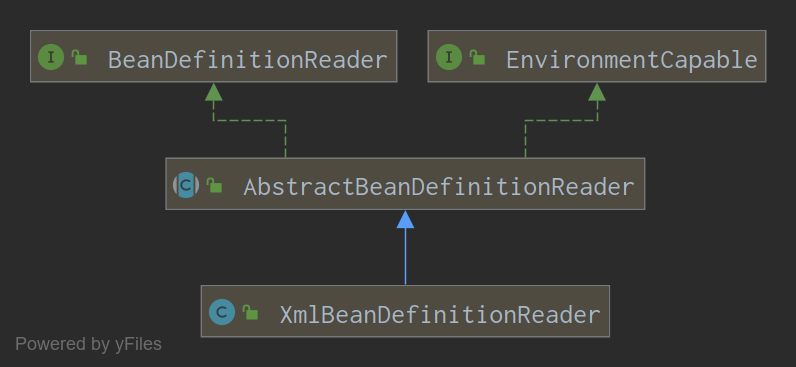

# SpringContext(4)-xml中的Bean定义节点加载成BeanDefinition对象

对于XML形式的Resource,实际调用XmlBeanDefinitionReader实例的reader.loadBeanDefinitions(configLocations)方法

下面是XmlBeanDefinitionReader的类UML图



实际调用的是抽象类AbstractBeanDefinitionReader的方法

```java
    public int loadBeanDefinitions(String location, @Nullable Set<Resource> actualResources) throws BeanDefinitionStoreException {
        ResourceLoader resourceLoader = getResourceLoader();
        if (resourceLoader == null) {
            throw new BeanDefinitionStoreException(
                    "Cannot load bean definitions from location [" + location + "]: no ResourceLoader available");
        }

        if (resourceLoader instanceof ResourcePatternResolver) {
            // Resource pattern matching available.
            try {
                Resource[] resources = ((ResourcePatternResolver) resourceLoader).getResources(location);
                int count = loadBeanDefinitions(resources);
                if (actualResources != null) {
                    Collections.addAll(actualResources, resources);
                }
                if (logger.isTraceEnabled()) {
                    logger.trace("Loaded " + count + " bean definitions from location pattern [" + location + "]");
                }
                return count;
            }
            catch (IOException ex) {
                throw new BeanDefinitionStoreException(
                        "Could not resolve bean definition resource pattern [" + location + "]", ex);
            }
        }
        else {
            // Can only load single resources by absolute URL.
            Resource resource = resourceLoader.getResource(location);
            int count = loadBeanDefinitions(resource);
            if (actualResources != null) {
                actualResources.add(resource);
            }
            if (logger.isTraceEnabled()) {
                logger.trace("Loaded " + count + " bean definitions from location [" + location + "]");
            }
            return count;
        }
    }
```

在这里，入参location是字符串"application-context.xml"，actualResources为null，程序执行过程如下

1. 获取resourceLoader对象，此对象负责把入参的location字符串规整为Resource对象数组
2. 遍历上一步规整好的Resource数组，对每一个Resource对象调用loadBeanDefinitions方法，此方法将初始化好的bean定义存入reader内部的registry变量中，
此变量即ApplicationContext的refresh方法新创建的beanFactory，在初始化reader的过程中被关联进来
3. 返回加载的BeanDefinition的数量

在[第三节:加载Resource对象成BeanDefinition](./XmlContext_3_LoadResource.md)中，已经将Resource解析成Document对象，并且遍历调用相关方法来对不同的DOM节点方法来加载内部定义，对于当前实例来说，Bean定义节点加载成BeanDefinition对象调用的是org.springframework.beans.factory.xml.DefaultBeanDefinitionDocumentReader对象的processBeanDefinition方法：

```java
    protected void processBeanDefinition(Element ele, BeanDefinitionParserDelegate delegate) {
        BeanDefinitionHolder bdHolder = delegate.parseBeanDefinitionElement(ele);
        if (bdHolder != null) {
            bdHolder = delegate.decorateBeanDefinitionIfRequired(ele, bdHolder);
            try {
                // Register the final decorated instance.
                BeanDefinitionReaderUtils.registerBeanDefinition(bdHolder, getReaderContext().getRegistry());
            }
            catch (BeanDefinitionStoreException ex) {
                getReaderContext().error("Failed to register bean definition with name '" +
                        bdHolder.getBeanName() + "'", ele, ex);
            }
            // Send registration event.
            getReaderContext().fireComponentRegistered(new BeanComponentDefinition(bdHolder));
        }
    }
```

1. delegate将DOM元素解析成BeanDefinitionHolder对象，此对象中存储BeanDefinition即Bean的属性、构造参数等信息，以及name，alias方法，并提供一些工具方法来访问这些属性
2. 装饰BeanDefinitionHolder对象
3. 将BeanDefinitionHolder注册到BeanRegistry
4. 抛出Bean注册完成事件

## 1.1 DOM元素解析成BeanDefinitionHolder对象：parseBeanDefinitionElement方法

BeanDefinitionParserDelegate的parseBeanDefinitionElement方法具体执行DOM节点到BeanDefinition对象的转化过程：

```java
    @Nullable
    public BeanDefinitionHolder parseBeanDefinitionElement(Element ele, @Nullable BeanDefinition containingBean) {
        String id = ele.getAttribute(ID_ATTRIBUTE);
        String nameAttr = ele.getAttribute(NAME_ATTRIBUTE);

        List<String> aliases = new ArrayList<>();
        if (StringUtils.hasLength(nameAttr)) {
            String[] nameArr = StringUtils.tokenizeToStringArray(nameAttr, MULTI_VALUE_ATTRIBUTE_DELIMITERS);
            aliases.addAll(Arrays.asList(nameArr));
        }

        String beanName = id;
        if (!StringUtils.hasText(beanName) && !aliases.isEmpty()) {
            beanName = aliases.remove(0);
            if (logger.isTraceEnabled()) {
                logger.trace("No XML 'id' specified - using '" + beanName +
                        "' as bean name and " + aliases + " as aliases");
            }
        }

        if (containingBean == null) {
            checkNameUniqueness(beanName, aliases, ele);
        }

        AbstractBeanDefinition beanDefinition = parseBeanDefinitionElement(ele, beanName, containingBean);
        if (beanDefinition != null) {
            if (!StringUtils.hasText(beanName)) {
                try {
                    if (containingBean != null) {
                        beanName = BeanDefinitionReaderUtils.generateBeanName(
                                beanDefinition, this.readerContext.getRegistry(), true);
                    }
                    else {
                        beanName = this.readerContext.generateBeanName(beanDefinition);
                        // Register an alias for the plain bean class name, if still possible,
                        // if the generator returned the class name plus a suffix.
                        // This is expected for Spring 1.2/2.0 backwards compatibility.
                        String beanClassName = beanDefinition.getBeanClassName();
                        if (beanClassName != null &&
                                beanName.startsWith(beanClassName) && beanName.length() > beanClassName.length() &&
                                !this.readerContext.getRegistry().isBeanNameInUse(beanClassName)) {
                            aliases.add(beanClassName);
                        }
                    }
                    if (logger.isTraceEnabled()) {
                        logger.trace("Neither XML 'id' nor 'name' specified - " +
                                "using generated bean name [" + beanName + "]");
                    }
                }
                catch (Exception ex) {
                    error(ex.getMessage(), ele);
                    return null;
                }
            }
            String[] aliasesArray = StringUtils.toStringArray(aliases);
            return new BeanDefinitionHolder(beanDefinition, beanName, aliasesArray);
        }

        return null;
    }
```

1. 处理bean的id、name和alias，并校验
2. 调用重载方法parseBeanDefinitionElement解析节点为AbstractBeanDefinition
3. 把解析出的BeanDefinition、beanName，alias包裹到BeanDefinitionHolder返回

### 1.1.1 bean的name和alias处理

bean的命名按下列顺序获取

1. 默认赋值为bean的id
2. 如果xml中有定义name属性，则取name属性覆盖成转化成的字符串数组第一个为name，其他的元素组成的数组为alias

name处理完毕后，delegate会校验同级的节点中有没有name重复的bean定义，如果有则报错

### 1.1.2 DOM元素解析成BeanDefinition对象：重载的parseBeanDefinitionElement方法

```java
    @Nullable
    public AbstractBeanDefinition parseBeanDefinitionElement(
            Element ele, String beanName, @Nullable BeanDefinition containingBean) {

        this.parseState.push(new BeanEntry(beanName));

        String className = null;
        if (ele.hasAttribute(CLASS_ATTRIBUTE)) {
            className = ele.getAttribute(CLASS_ATTRIBUTE).trim();
        }
        String parent = null;
        if (ele.hasAttribute(PARENT_ATTRIBUTE)) {
            parent = ele.getAttribute(PARENT_ATTRIBUTE);
        }

        try {
            AbstractBeanDefinition bd = createBeanDefinition(className, parent);

            parseBeanDefinitionAttributes(ele, beanName, containingBean, bd);
            bd.setDescription(DomUtils.getChildElementValueByTagName(ele, DESCRIPTION_ELEMENT));

            parseMetaElements(ele, bd);
            parseLookupOverrideSubElements(ele, bd.getMethodOverrides());
            parseReplacedMethodSubElements(ele, bd.getMethodOverrides());

            parseConstructorArgElements(ele, bd);
            parsePropertyElements(ele, bd);
            parseQualifierElements(ele, bd);

            bd.setResource(this.readerContext.getResource());
            bd.setSource(extractSource(ele));

            return bd;
        }
        catch (ClassNotFoundException ex) {
            error("Bean class [" + className + "] not found", ele, ex);
        }
        catch (NoClassDefFoundError err) {
            error("Class that bean class [" + className + "] depends on not found", ele, err);
        }
        catch (Throwable ex) {
            error("Unexpected failure during bean definition parsing", ele, ex);
        }
        finally {
            this.parseState.pop();
        }

        return null;
    }
```

1. 获取class和parent定义
2. 根据class、parent和当前的ClassLoader初始化GenericBeanDefinition
3. 解析属性("scope","abstract","lazy-init","auto-wire", "depends-on"等)并存入bean定义对象中
4. 解析"description"并存入bean定义
5. 解析bean的元数据即\<meta>子节点，并包裹成BeanMetadataAttribute对象存入bean定义
6. 解析\<lookup-method>子节点，包裹成LookupOverride对象并存入bean定义的Override数组
7. 解析\<replaced-method>子节点，包裹成ReplaceOverride对象并存入bean定义的Override数组
8. 解析\<constructor-arg>子节点
9. 解析\<property>子节点
10. 解析\<qualifier>子节点
11. 存入Resource和Source

#### 1.1.2.1 初始化BeanDefinition

调用BeanDefinitionReaderUtils的静态方法```createBeanDefinition(parentName, className, this.readerContext.getBeanClassLoader())```来初始化BeanDefinition，初始化的是GenericBeanDefinition对象，class对象的处理如下：

```java
    public static AbstractBeanDefinition createBeanDefinition(
            @Nullable String parentName, @Nullable String className, @Nullable ClassLoader classLoader) throws ClassNotFoundException {

        GenericBeanDefinition bd = new GenericBeanDefinition();
        bd.setParentName(parentName);
        if (className != null) {
            if (classLoader != null) {
                bd.setBeanClass(ClassUtils.forName(className, classLoader));
            }
            else {
                bd.setBeanClassName(className);
            }
        }
        return bd;
    }
```

由于readerContext没有指定特殊的ClassLoader，因此此处bd中只存储BeanClassName

#### 1.1.2.2 解析属性：parseBeanDefinitionAttributes(ele, beanName, containingBean, bd)

需要解析的属性列表如下：

- "singleton":属性已被移除，检测到此定义会报错
- "scope"
- "abstract"
- "lazy-init":如果定义成"default"，则跟当前delegate的默认一致，否则跟指定属性一致，如果都没定义，则为false即不进行懒加载
- "autowire":默认是"default",可选"byName","byType","constructor","autodetect"
- "depends-on":字符串数组，",; "分割
- "autowire-candidate"：是否指定了自动注入的候选，默认为true
- "primary"：默认false
- "init-method"：指定初始化方法
- "destroy-method"：指定destroy方法
- "factory-method"：指定工厂方法名
- "factory-bean"：指定工厂Bean的名称

## 1.2 装饰BeanDefinitionHolder对象

从源码来看，只装饰非Spring默认命名空间的对象

## 1.3 注册BeanDefinitionHolder到Registry

调用了BeanDefinitionReaderUtils的registerBeanDefinition方法，代码如下

```java
    public static void registerBeanDefinition(
            BeanDefinitionHolder definitionHolder, BeanDefinitionRegistry registry)
            throws BeanDefinitionStoreException {

        // Register bean definition under primary name.
        String beanName = definitionHolder.getBeanName();
        registry.registerBeanDefinition(beanName, definitionHolder.getBeanDefinition());

        // Register aliases for bean name, if any.
        String[] aliases = definitionHolder.getAliases();
        if (aliases != null) {
            for (String alias : aliases) {
                registry.registerAlias(beanName, alias);
            }
        }
    }
```

一共分为两步，第一步注册beanName和内部的beanDefinition，第二部注册别名aliases

### 1.3.1 注册beanName和内部的beanDefinition

调用了Registry（在这里是XmlClassPathApplicationContext的父类DefaultListableBeanFactory的registerBeanDefinition方法，分下列几个步骤处理

1. 校验传入的beanHolder里的BeanDefinition
2. 校验传入的beanHolder里的beanName是否重复，重复的话根据配置决定报错或放行
3. beanName不重复的情况下，把bean定义，名称分别放入内部的beanDefinitionMap和beanDefinitionNames
4. manualSingletonNames中移除beanName
5. 清空frozenBeanDefinitionNames
6. 重置传入的bean相关的缓存

#### 1.3.1.1 校验beanDefinition

1. 如果指定了静态工厂方法，则不可以使用MethodOverride
2. 如果是自定义ClassLoader加载的类（即class不为空），则初始化MethodOverride

#### 1.3.1.2 校验重复定义Bean

根据传入的beanName，查看当前registry是否有同名的bean，如果有的话，按下列策略处理

1. 如果不允许bean定义覆写(Override)，报错
2. 如果允许复写且已有的bean的Role低于当前要存入的bean，则info打印，Role的排序为：ROLE_APPLICATION\<ROLE_SUPPORT\<ROLE_INFRASTRUCTURE
3. 如果不属于优先级导致的复写，debug打印
4. 上述都不符合，则trace打印

如果beanName重复且上述校验通过，则新的beanDefinition覆盖已有的同名定义

#### 1.3.1.3 bean定义存储时的线程安全

如果当前有bean被标记为已创建，则需要考虑存入beanDefinitionMap和beanDefinitionNames时的线程安全性，因为bean创建过程中，各线程可能正在现有的beanDefinitionNames中迭代，因此，放入新beanName时，需要新建ArrayList并重新拷贝数据，而不是修改现有的ArrayList，后者会导致现有的bean创建线程的迭代出现问题。

线程同步使用的锁为beanDefinitionMap

```java
    // Cannot modify startup-time collection elements anymore (for stable iteration)
    synchronized (this.beanDefinitionMap) {
        this.beanDefinitionMap.put(beanName, beanDefinition);
        List<String> updatedDefinitions = new ArrayList<>(this.beanDefinitionNames.size() + 1);
        updatedDefinitions.addAll(this.beanDefinitionNames);
        updatedDefinitions.add(beanName);
        this.beanDefinitionNames = updatedDefinitions;
        removeManualSingletonName(beanName);
    }
```

#### 1.3.1.4 重置bean相关单例缓存

如果bean被定义为SingleTon，则需要清理缓存，主要包括以下内容：

1. 从mergedBeanDefinitions移除相关内容
2. 从内部维护的Singleton相关的缓存中移除beanName相关的内容
3. 从disposableBeans中移除相关内容
4. 从containedBeanMap和dependentBeanMap中**沿路径移除所有**的包含bean和依赖bean
5. 从allBeanNamesByType和singletonBeanNamesByType中移除

至此beanName和内部的beanDefinition注册完成

#### 1.3.2 注册别名

别名存放在beanFactory的父类SimpleAliasRegistry的内部属性```Map<String, String> aliasMap```中，key为别名，value为bean名，存储的时候校验别名和bean名不可重复且不可成环状，别名注册完成后，整个beanDefinitionHolder注册完成

## 1.4 抛出Bean注册完成事件

将上面注册完成的beanDefinitionHolder包裹成BeanComponentDefinition对象后，调用readerContext的eventListener对象的componentRegistered方法，在这里eventListener为EmptyReaderEventListener对象，方法体为空，因此不执行任何操作。

到此，xml中的\<bean>节点处理完成
